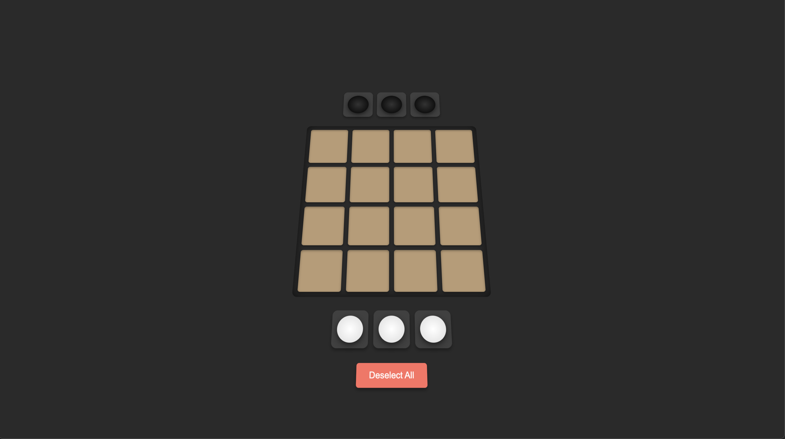
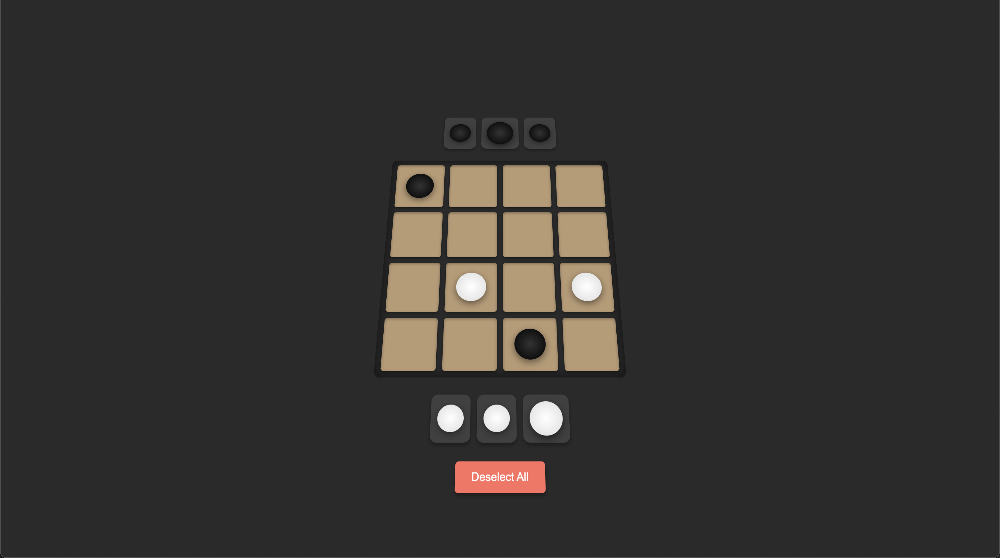

# PythonGobblet

## Overview
This is an implementation of the board game called "Gobblet" along with an AI opponent to play against. It's a two-player game that involves moving and stacking pieces with the goal of being the first player to get 4 pieces in a row horizontally, vertically or diagonally. The AI uses the minimax algorithm optimized with alpha-beta pruning to determine the best move to make.

I built this game to explore the use of the minimax algorithm and different ways to build game AI opponents. This is an interesting task since you need to think of ways to optimize search through a space of n-next possible game states.

The user always gets first move and the opponent responds automatically until there is a winner.




### Built With
* 
* 
* 
* 
* 


## Project Structure
    .
    |-- static
    |   |-- css
    |   |   |-- styles.css      # CSS styles for the web page
    |   |-- js
    |   |   |-- scripts.js      # Scripts used for frontend board updates
    |-- templates
    |   |-- index.html          # Frontend board html
    |-- game_state.py           # GameState class used to create and update the board's state
    |-- main.py                 # Flask API
    |-- minimax.py              # TreeNode class used to create and search the state tree
    |-- README.md
    |-- requirements.txt        # Dependencies

## Installation and Setup
1. Clone the repository
2. Install dependencies
    ```sh
    pip install -r requirements.txt
    ```
3. Run the project
    ```
    flask --app main run
    ```

## Roadmap
- [] Implement check_winner
- [] improve state scoring to make minimax more accurate
- [] Update game reset functionality and button
- [] Add winner animation
- [] Add difficulty selection
- [] Continue to optimize minimax


## Algorithms
### Minimax implementation
When implementing minimax with alpha-beta pruning, I started by modeling a way to represent the state space of the board game. After multiple iterations, the simplest method seemed to be to represent the board as a 3D array where there are 4 rows and 4 columns of the board and stacks for each space on the board. Then, each player (the agent and the user) needed t0 each have 2 stacks at home (where the pieces start).

Pieces were initially represented as objects of a Piece class although this proved to be unnecesssary. The best way to represent the pieces is a tuple containing the initial stack ID of the piece and the size of the piece. To simplify things, instead of adding a third value to distinguish who the piece belongs to, I use a negative integer for the size of the agents pieces. Since this needs to be absolute valued for size comparison, it may be better to alter the initial position ID of the piece for the demarcation of pieces. We also use the initial position ID for indexing, so alteration would have to occur there as well. It may be fine in the end to just add a third value to represent who the piece belongs to.

Movable pieces are also tracked for ease of determining valid moves. Each player's movable pieces are represented in a set() for better efficiency when removing pieces from the set.

In scoring states I track many variables of the state including: pieces covering other pieces, number of pieces per player showing on the board, winning states, losing states etc. After scoring a state, it's value is used in the minimax algorithm to determine the best move. This algorithm examines all possible moves in a state tree assuming that the agent would make a move to maximize the state score on it's turns and the player would do the opposite.

Using alpha-beta pruning allows us to ignore uneccessary states and thus traverse to a lower depth with better computational efficiency.

To adjust the difficulty of the agent we can adjust multiple variables such as the scoring weights or the depth of the minimax traversal.

### Where to optimize
It seems that the best place to optimize this algorithm would be in the scoring of states and in eliminating non-unique moves when reporting valid moves. The agent iterates rows and columns of the board to score the board. If the method of scoring or the representation of pieces were adjusted, the agent may be able to score in a more efficient manner that does not require iteration (using numpy). Due to mirroring and rotation, there is potential for moves that produce duplicate states. Eliminating these could lead to an even more efficient agent.
